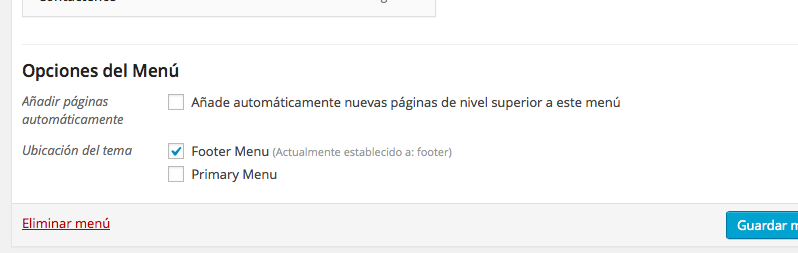

Se resume en:

1. Registrar un nuevo menú en el tema.
2. Cargar el menú en algún lugar de nuestro tema.

Para registrar el nuevo menú agregamos las siguientes lineas a nuestro archivo `functions.php`

    function mi_tema_after_setup() {
    		register_nav_menu( 'id', 'id humano' ) );
    }
    add_action( 'after_setup_theme', 'mi_tema_after_setup' );

Claramente los id deben ser únicos, como `footerMenu` y `Menú del Footer`, respectivamente.

Para cargar el menú en algún lugar de nuestro tema:

    wp_nav_menu( array( 'theme_location' => 'id', 'menu_class' => 'clases-css-adicionales' ) );

La función ya trae un _built-in_ que devuelve una lista desordenada `ul` con cada elemento del menú.

	

Ahora, en **Apariencia - Menús**, basta con crear un nuevo menú y elegir la ubicación del tema en la parte inferior, donde aparecerá nuestro `id humano`
