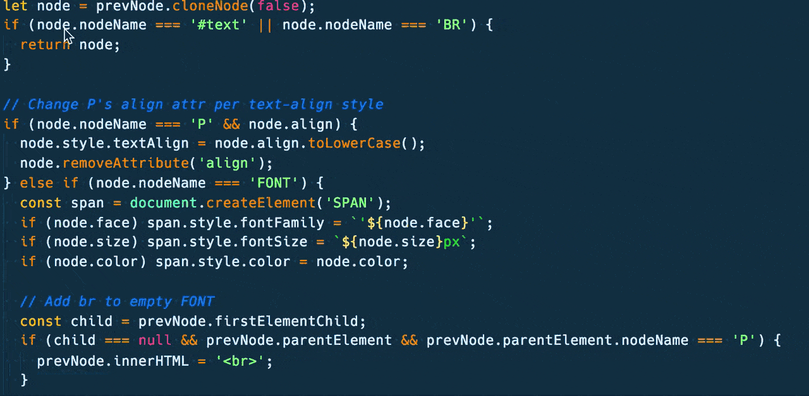
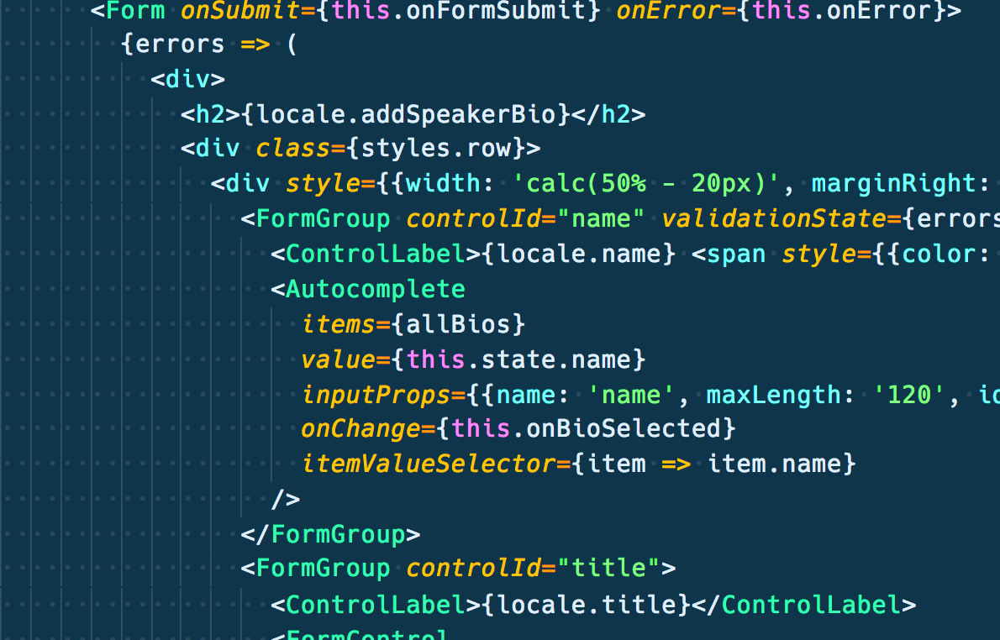

> In my years of experience, I have found some features I am always looking for when I'm using an Editor. Features which allows me to write faster and better code.

These are my 6 must features your editor should have, and I also included a **bonus** at the end.

**Heads up:** I am going to put the keyboard shortcuts only for MacOS using VS Code Editor. You should Google the right shortcut if you have any different setup.

## 0. Word selection.

I love this feature because it looks so basic and useless, but believe me, it'll save you a ton of time when making selections from keyboard, and when combining together with other commands, it is very powerful.

I am pretty sure shortcut is the one I use the most everyday.

**Keyboard shortcut:** `CMD` + `D`.

## 1. Multicursors.

This one blows the mind for every one which see it for the very first time.

**Keyboard shortcut:** Hold `CMD` key, and `Click` wherever you want to put a cursor.

## 2. Multiselection.

This feature is a sort of comibation between word selections and multicursors.

**Keyboard shortcut:** `CMD` + `D` Multiple times over a word or chunk of code.

## 3. Render whitespaces.

Either your project uses tabs or spaces, you should always use a consistent style. And being able to see if there is a space or tab really makes the difference.

<em>Do you see those little dots? Those are spaces. Tabs get rendered as `->`.</em>

**Add to Settings:** `"editor.renderWhitespace": "all"`.

## 4. Version Control Integration.

Being able to see what is new in a file, what have changed, and where in the file are you working on, is priceless. You get that by integrating your editor with the version control software you are using on the project.

<em>VS Code include Git integration by default</em>

## 5. Snippets.

No matter the library or framework you use, even if you use vanilla JavaScript there are boilerplate code you need to write down every time. Snippets will save you some time.

I use: [Emmet](https://code.visualstudio.com/docs/editor/emmet), [ES6](https://marketplace.visualstudio.com/items?itemName=xabikos.JavaScriptSnippets), And [React](https://marketplace.visualstudio.com/items?itemName=burkeholland.react-food-truck) Snippets.

## 6. Linting.

Making typos is so easy when coding. Choose an editor which will help you out in _real time_ to catch up those kind of errors. Code completion is also very helpful and VS Code's is great at it.

## [Optional] Font and Theme.

Just make sure you use a font which display characters easily distinguishable. [Hack](https://sourcefoundry.org/hack/) and [Iconsolata-dz](https://github.com/powerline/fonts/tree/master/InconsolataDz) are great. For color schemas I am currently using Coda2, available for [Sublime Text](https://packagecontrol.io/packages/Theme%20-%20Cobalt2) and [VS Code](https://marketplace.visualstudio.com/items?itemName=wesbos.theme-cobalt2)

## Bonus: Clipboard Manager.

This will change your life. A clipboard manager gives you the ability to keep a history for every text you have copied to the clipboard. You won't need to switch over diffent applications for copying and pasting multiple things.

<video controls="true" preload src="8-clipboard-managment.mp4" />

For MacOS users, [Flycut](https://itunes.apple.com/us/app/flycut-clipboard-manager/id442160987) works like a charm. Make sure you remember the key combination for opening up the history.

## That's it!

– Huh? But there are thousands of plugins an extensions out there you can install
– Yes, I know, but extensions are just a plus, you don't really need those. That is why the are named... extensions. Also some may not be available for all Editors.
– Wait, what Text Editor or <abr title="Integrated Development Enviroment">IDE's</abr> should I use finally?
– Just use the editor where you are efficient, and stick to it.

> At the of the day, choosing a Text Editor or <abr title="Integrated Development Enviroment">IDE's</abr> is just a matter of taste. There is no such thing as the perfect Editor.

Is there any other feature you consider vital? [Tweet me](https://twitter.com/share?text=@jonalvarezz).
