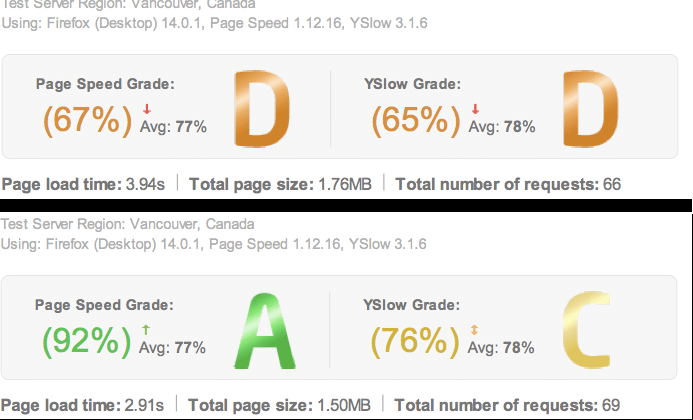

Esta es una forma muy sencilla de optimizar el rendimiento y tiempo de carga de cualquier instalación de wordpress. Son 6 simples pasos y se puede lograr un aumento hasta del 30%.

> Antes y despues de realizar estos pasos, mide tu sitio para saber cuánto ha mejorado. Recomiendo hacerlo desde [Gtmetrix](http://gtmetrix.com) y [Pingdoom Tools](http://tools.pingdom.com/fpt)

## 1. Definir reglas de compresión en `.htaccess`

Realiza primero un backup de este archivo en caso que algo salga mal
	
		cp .htaccess .htaccess.bkp

		Ahora, agregamos las siguientes reglas a las existentes en el archivo

	## BEGIN wordpress optimization

		Header unset Pragma
		FileETag None
		Header unset ETag

		<IfModule mod_headers.c>
			<FilesMatch \"\\.(js|css|xml|gz)$\">
				Header append Vary Accept-Encoding
			</FilesMatch>
		</IfModule>

		<FilesMatch \"\\.(gif|jpg|jpeg|png|ico)$\">
				ExpiresActive On
				ExpiresDefault \"access plus 1 month\"
		</FilesMatch>

		<FilesMatch \"\\.(css|js|html?|xml|txt)$\">
				ExpiresActive On
				ExpiresDefault \"access plus 1 week\"
		</FilesMatch>

		# compress text, html, javascript, css, xml:
		AddOutputFilterByType DEFLATE text/plain
		AddOutputFilterByType DEFLATE text/html
		AddOutputFilterByType DEFLATE text/xml
		AddOutputFilterByType DEFLATE text/css
		AddOutputFilterByType DEFLATE application/xml
		AddOutputFilterByType DEFLATE application/xhtml+xml
		AddOutputFilterByType DEFLATE application/rss+xml
		AddOutputFilterByType DEFLATE application/javascript
		AddOutputFilterByType DEFLATE application/x-javascript

		# Or, compress certain file types by extension:
		<Files *.html>
		SetOutputFilter DEFLATE
		</Files>

		## END wordpress optimization

		Guardan, e ingresan al sitio para comprobar que cargue sin problemas.

## 2. Utilizar plugin Photon.
Photon es una extensión del plugin de [Jetpack](http://jetpack.me) y lo que hace es funcionar como un <abbr title=\"Content Delivery Network\">CDN</abbr> sirviendo las imágenes de nuestro sitio por nosotros, acelerando así la carga del sitio y menor consumo de ancho de banda.

[Descargar Jetpack](http://wordpress.org/plugins/jetpack/)

Aunque tenga sus detractores, por temas de SEO en imágenes, ciertamente mejora el mucho rendimiento. Aprovechando que estas en la configuración de Jetpack, deshabilita todo lo que no necesitas y desconozcas.

## 3. Utilizar plugin de cache.
Esto es quizas lo más importante y que más les ayudará. TIENEN que instalar un plugin que se haga cargo de gestionar el cache de su sitio, existen muchísimos, recomiendo:
* [Quick cache](http://wordpress.org/plugins/quick-cache/)
* [WP Super Cache](http://wordpress.org/plugins/wp-super-cache/)
* [W3 Total Cache](http://wordpress.org/plugins/w3-total-cache/)

*El sencillo, el moderado y el avanzado, respectivamente.* Todos son igual de buenos. Todos poseen opciones para no hacer cache de ciertas páginas, como por ejemplo si tienes tienda virtual, un carro de compras, etc.

## 4. Usar jQuery desde el CDN de Google.
*Esto puede causar comportamientos inesperados o romper el funcionamiento de algunos plugins.*

jQuery es ampliamente usado por otros plugins y wordpress por defecto la carga desde nuestro servidor. Podemos agilizar las cosas y permitir que se cargue en paralelo con nuestro sitio utilizando el CDN que Google provee.

Y para ello existe basta con agregar al final del archivo `functions.php` del tema:

		function jquery_cdn() {
			 if (!is_admin()) {
					wp_deregister_script('jquery');
					wp_register_script('jquery', '//ajax.googleapis.com/ajax/libs/jquery/1.10.2/jquery.min.js', false, '1.10.2');
					wp_enqueue_script('jquery');
					}
			 }
		add_action('init', 'jquery_cdn');

[Pueden cambiar la versión de jQuery por la que deseen.](https://developers.google.com/speed/libraries/devguide#jquery)

## 5. Mover los archivos `js` al footer.
*Esto puede causar comportamientos inesperados o romper el funcionamiento de algunos plugins.*

El script es:

		remove_action('wp_head', 'wp_print_scripts');
		 remove_action('wp_head', 'wp_print_head_scripts', 9);
		 remove_action('wp_head', 'wp_enqueue_scripts', 1);
		 add_action('wp_footer', 'wp_print_scripts', 5);
		 add_action('wp_footer', 'wp_enqueue_scripts', 5);
		 add_action('wp_footer', 'wp_print_head_scripts', 5);

De nuevo, esto puede romper el funcionamiento de algunos plugins, y deberás regisrar todos los plugins  de tu tema en el footer. Por ejemplo:

	wp_enqueue_script( 'miPlugin', '', '', '', true );

*El `true` al final indica que se debe cargar en el footer.* 

Hagan bien sus pruebas y atentos a los errores en ejecución de Javascript.

## 6. Eliminar Query Strings de archivos estáticos
Si? lo han visto? `http//misitio.com/wp-content/themes/mitema/js/archivo.js?ver=2.4.1`

Bien, pues Wordpress pone una query strings a todos los archivos `js` y `css` que carguemos para indicar la versión del script/stylesheet y que no sirve para nada excepto para que alguien obtenga más  información y el tiempo de carga sea un poco más lento.

Los removemos así:

	function remove_query_script( $src ){
		$parts = explode( '?', $src );
		return $parts[0];
	}
	add_filter( 'script_loader_src', 'remove_query_script', 15, 1 );
	add_filter( 'style_loader_src', 'remove_query_script', 15, 1 );

Tendrás conflictos si necesitas de alguna query string, como por ejemplo Google Webfonts o la API de Google Maps, pero con otra linea de más en el script controlas la excepción.

## 7. Comparte tus resultados
Este es uno de los mios:

