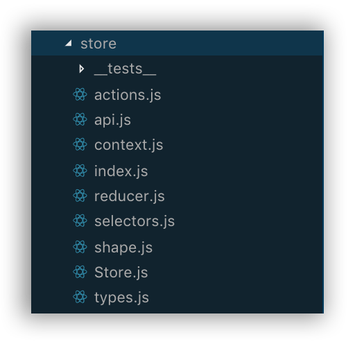
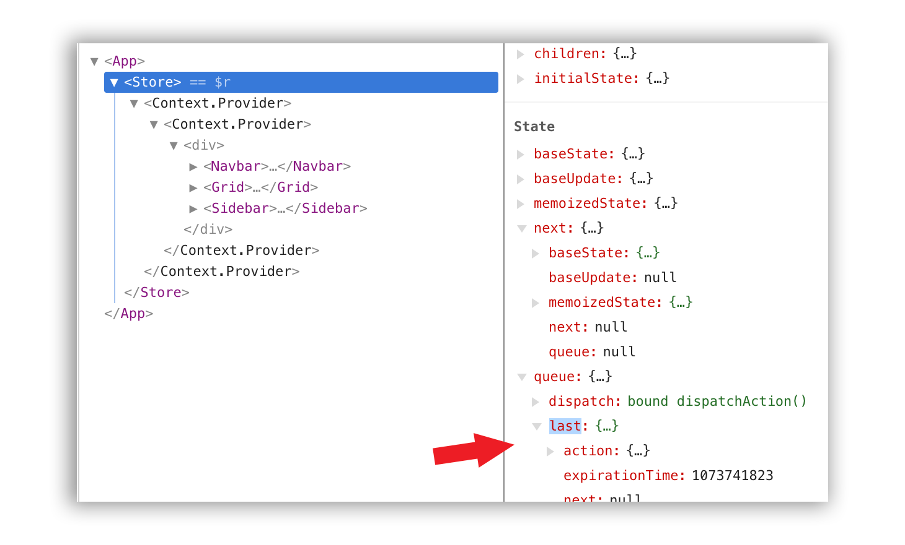

> Heads up! Do not use this in production.

When React Context got its [new and official API](https://reactjs.org/blog/2018/03/29/react-v-16-3.html), I was very skeptical about Redux dying; Now, with React Hooks, I am starting to have a second thought.

I decided to create an application using **React Hooks and React Context** to build an architecture similar to **Redux**, and assert how similar they could get to be, as well as how suitable the new tools are for the job.

## TL:DR;

- Jump to the [conclusions](#conclusions).
- Take a look at the application code [here](https://github.com/jonalvarezz/react-next-example)

## React Hooks are convenient

Yes, They looked very weird to me at first, and to be honest, it is still the feature I am the least excited about after the React Conf.

However, once you start using them, you become productive very quickly, and I found that I stopped worrying about _what does React needs to properly work_ (in terms of lifecycles); to just declaring my logic and let React make its _magic_.

Plus, React Hooks do not introduce breaking changes, nor new concepts, and luckily, no more nested components to share logic and states as HoCs or Render Props needed.

## React.useReducer

As part of the React Hooks RFC, the `React.useReduce` brings us the possibility to declare changes in the state as the result of a function that receives an action describing the change:

```
	(state, action) => newState
```

If you are familiar with Flux-like patterns like Redux, you already know this.

Now with this Hook as part of the React library, you might not need to use other libraries for state management as the React team will support this way of declaring changes to the state of the application.

## How is React.Context important here?

React.useReducer will provide us a way to declare changes and mutate our state, as we do with Redux, however, we still need a way to easily _connect_ our deepest children with our states, without falling in [_prop drilling_](https://blog.kentcdodds.com/prop-drilling-bb62e02cb691).

Context API is a built-in way to expose data through components without passing props down.

Therefore, what if we wrap our main component to handle the application's state with `React.useReducer` and we pass down the state using `React.Context`?

## Show me the code

This is how the Store component ends up being like:

<p class="text-center"></p>
<p class="text-center"><small>_See full version on [GitHub.com/jonalvarezz](https://github.com/jonalvarezz/react-next-example/blob/master/src/store/Store.js)_</small></p>

### What's cool about it?

- We are using `useReducer` to set our initial state
- The `state` will be passed down with Context in `<StoreContext.Provider value={{ ...state, dispatch }}>`
- We are passing down the dispatch method to allow children to trigger actions
- We are using the `useEffect` hook to call our API and set some data in the store.

To achieve that, I created a **file structure** that may result very familiar to you:

<p class="text-center"></p>
<p class="text-center"><small>_See on [GitHub.com/jonalvarezz](https://github.com/jonalvarezz/react-next-example/blob/master/src/store)_</small></p>

### What's cool about it?

- If you worked with Flux-like architectures, this will be familiar to you.
- Same concepts.
- Other than React Context and Hooks, which have a very short-term cognitive cost to learn (really!), there are no added concepts.

Now, I can use the Store component, which is a Context.Provider Component, to pass down the reducer state. Thus, I can wrap my application:

<p class="text-center"></p>
<p class="text-center"><small>_See full version on [GitHub.com/jonalvarezz](https://github.com/jonalvarezz/react-next-example/blob/master/src/App.js)_</small></p>

To finally, being able to connect children components to get whatever data they need, and make'em able to dispatch actions to mutate the store!

<p class="text-center"></p>
<p class="text-center"><small>_See full version on [GitHub.com/jonalvarezz](https://github.com/jonalvarezz/react-next-example/blob/master/src/components/sidebar/Sidebar.js)_</small></p>

### What's cool about it?

- No more HoCs nor nested logic to connect to the store, not even the need to fiddle around with React’s lifecycles
- We can fire actions that mutate the store from children easily
- Small and plain Components

## Conclusions

- Even though this architecture may result handy, it will be limited to React-only applications. Redux can be used with any other library.

- **Same concepts can be implemented**. I used concepts like selectors and actions creators. You can go further and wrap the dispatch function in order to accept Promises and other functions, same as Redux Middleware.

- **Your code is less bloated**. Using Hooks instead of HoCs and Render Props does really help you to keep your components plain.

- **You lose Redux DevTools**. That tool is great for debugging, and if Hooks make its way into React 17, it'll be a matter of time for that kind of tools to be integrated with `React.useReducer`.<p></p>In the meantime, if you have the React extension installed, inspecting a `React.useReducer` powered Component, you get very useful information and details to debug your actions and app's state. It is like a _tiny packed-up Redux Devtool_.

<p class="text-center"></p>

- **About Hooks**. Although I disliked the idea of introducing _magic_ to React's API at first, once I tried them I started to enjoy using React without worrying about lifecycles.<p></p>Even though, **I strongly suggest newcomers to deeply learn about React's lifecycles**, as at the end, **the right use of a Hook, highly depends on your understanding of React**.<p></p>For instance, take a look to the `React.useEffect` [second parameter](https://reactjs.org/docs/hooks-reference.html#useeffect). You can easily miss it being new to React and end up with a lot of unnecessary re-renders and effects.

<p class="text-center"></p>
<p class="text-center"><small>_See full version on [GitHub.com/jonalvarezz](https://github.com/jonalvarezz/react-next-example/blob/master/src/store/Store.js)_</small></p>

- And finally, we are about to enter a _new era_ of React's rich diversity. Do you remember the hype when Flux came out? Well... you better sit down, grab some popcorn and enjoy the _JavaScript fatigue_.
