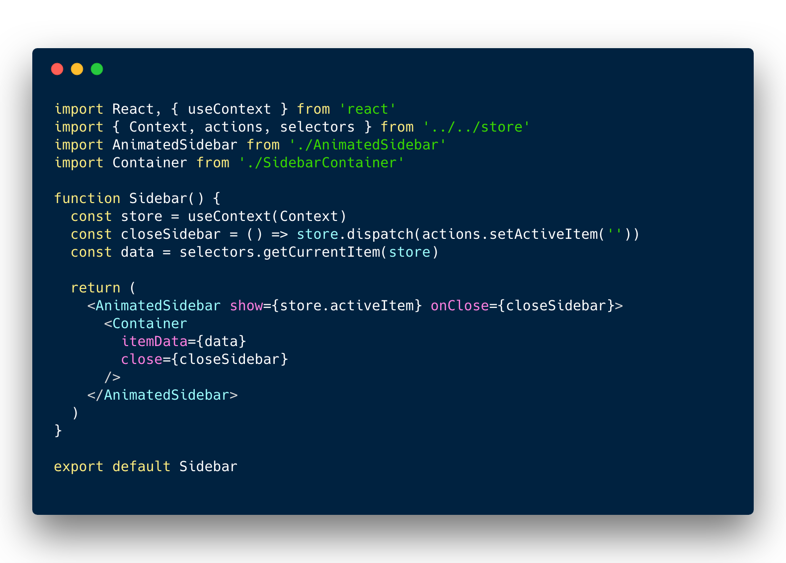

<small>_Photo by [Noah van de Wetering ](https://unsplash.com/photos/bvDWbe0zI6Y) on [Unsplash](https://unsplash.com)_</small>

> Heads up! Do not use this production.

When React Context got its [new and official API](https://reactjs.org/blog/2018/03/29/react-v-16-3.html), I was very skeptical about Redux dead; Now, with React Hooks, I am starting to doubt it.

I decided to create an application using **React Hooks and React Context** to build an architecture similar as with **Redux**, and so get to know how similar and suitable that could be.

## TL:DR;

- Jump to the [conclusion](#conclusion).
- Take a look to the application code [here]()

## React Hooks are convenient

Yes, They looked very weird to me at the beggining, and to be honest, it is still the feature I am the least excited about after the React Conf.

However, once you start using them, you become productive very quickly, and I found out that I stopped worrying about _what does React needs to properly work_ (in terms of lifecycles); to just declaring my logic and let React makes its _magic_.

Plus, React Hooks does not introduce breaking changer, nor new concepts, and luckily, no more nested components to share logic and states as HoCs or Render Props needs.

## React.useReducer

As part of the React Hooks RFC, the `React.useReduce` bring us the posibility to declare changes in the state as the result of a function that recibes an action describing the change:

```
	(state, action) => newState
```

If you are familiar with Flux-like patterns like Redux, you already know this.

Now with this hook as part of the React library, you might not need to use other libraries for state management as React team will support this way of declaring changes.

## How is React.Context important here?

React.useReducer will provide us a way to declare changes and mutate our state, as we do with Redux, however we still need a way to easily _connect_ our deepest children with our states, without falling in [_prop drilling_](https://blog.kentcdodds.com/prop-drilling-bb62e02cb691).

Context API is built-in way in React to expose data through components without padding props down.

Therefore, what if we wrap our main component to handle the application's state with `React.useReducer` and we pass down the state using `React.Context`?

## Show me the code

This is how our Store component looks like:

<p class="text-center"></p>
<p class="text-center"><small>_See full version on [GitHub.com/jonalvarezz](https://github.com/jonalvarezz/react-next-example/blob/master/src/store/Store.js)_</small></p>

### What's cool about it?

- We are using `useReducer` to set our initial state
- The `state` will be passed down with Context in: `<StoreContext.Provider value={{ ...state, dispatch }}>`
- We are passing down the dispatch method to allow chidren to trigger actions
- We are using the `useEffect` hook to call our API and set some data in the store.

Now we can wrap our application with our Store

<p class="text-center"></p>
<p class="text-center"><small>_See full version on [GitHub.com/jonalvarezz](https://github.com/jonalvarezz/react-next-example/blob/master/src/App.js)_</small></p>

Then, we can connect our components with the Store:

<p class="text-center"></p>
<p class="text-center"><small>_See full version on [GitHub.com/jonalvarezz](https://github.com/jonalvarezz/react-next-example/blob/master/src/components/sidebar/Sidebar.js)_</small></p>

### What's cool about it?

- No more HoCs nor nested logic to connect to the store, not even handling with React's lifecycles
- We can fire actions that mutate the store from children easily
- Small and plain Components

I also created a file structure very similar as Redux or Flux-like:

<p class="text-center"></p>
<p class="text-center"><small>_See on [GitHub.com/jonalvarezz](https://github.com/jonalvarezz/react-next-example/blob/master/src/store)_</small></p>

### What's cool about it?

- If you worked with Redux, this will be familiar to you.
- Same concepts.
